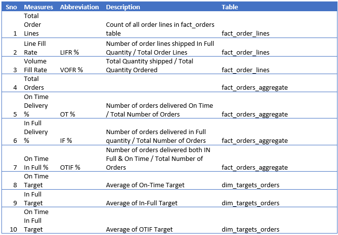
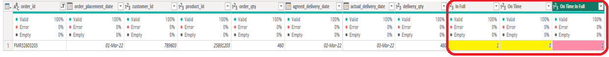
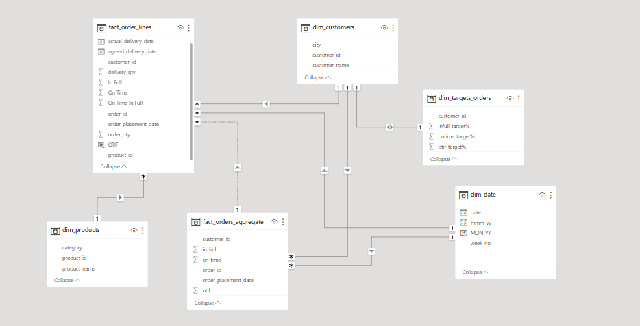
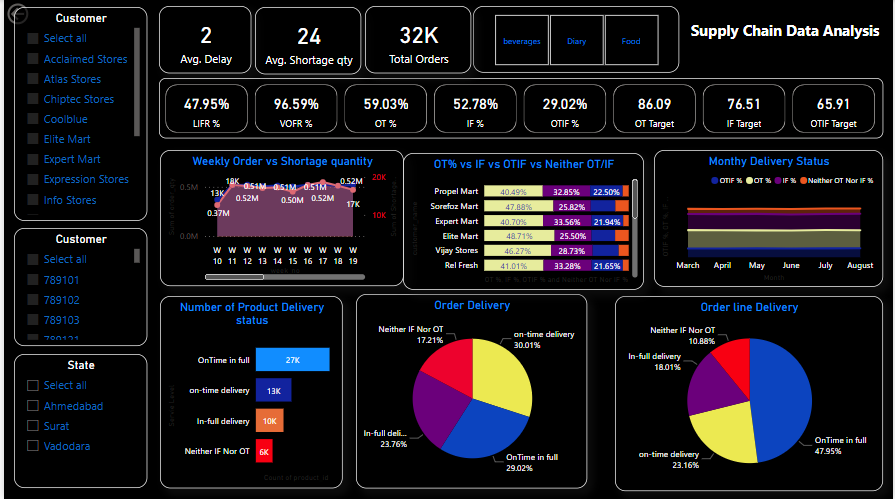

# Supply Chain Data Analysis

## Project
Generate Insights to Solve a Supply Chain Issue in FMCG Domain

## Problem Statment
GDS Mart is a growing FMCG manufacturer headquartered in Gujarat, India. It is currently operational in three cities Surat, Ahmedabad and Vadodara. They want to expand to other metro/tier1 cities in the next 2 years.

GDS Mart is currently facing a problem where a few key customers have not extended the annual contract due to service issues. It is speculated that some of the essential products were either not delivered on time or not delivered in full over a continued period, which could have resulted in bad customer service. Management wants to fix this issue before expanding to other cities and requested their supply chain analytics team to track the ’On time’ and ‘In Full’ delivery service level for all the customers on a daily basis so that they can respond swiftly to these issues.

The Supply Chain team decided to use a standard approach to measure the service level in which they will measure ‘on-time delivery (OT) %’, ‘In-full delivery (IF) %’ and OnTime in full (OTIF) % of the customer orders on a daily basis against the target service level set for each customer.

## Task:
Mr. Analyst is the data analyst in the supply chain team who joined GDS Mart recently. He has been briefed about the task in the stakeholder business review meeting. Now Imagine yourself as Mr. Analyst and play the role of the new data analyst who is excited to build this dashboard and perform the following task:

•	Create the metrics according to the metrics list provided

•	Create a dashboard according to the requirements provided by stakeholders in the business review meeting. You will be provided with the transcript of this business review meeting in the form of a comic.
•	Create relevant insights that are not provided in the metric list/stakeholder meeting.

## Meta Data:
There are 6 CSV files provided(/Raw%20Data):

    1. dim_customers.csv
    2. dim_products.csv
    3. dim_date
    4. dim_targets_orders
    5. fact_order_lines.csv
    6. fact_orders_aggregate.csv

Column Description for dim_customers:

    1. customer_id: Unique ID is given to each customer
    2. customer_name: Name of the customer
    3. city: It is the city where the customer is present

Column Description for dim_products:

    1. product_name: It is the name of the product
    2. product_id: Unique ID is given to each of the products
    3. category: It is the class to which the product belongs

Column Description for dim_date:

    1. date: date at the daily level
    2. mmm_yy: date at the monthly level
    3. week_no: week number of the year as per the date column

Column Description for dim_targets_orders:

    1.	customer_id: Unique ID that is given to each of the customers
    2.	ontime_target %: Target assigned for Ontime % for a given customer
    3.	infull_target %: Target assigned for infull % for a given customer
    4.	otif_target %:   Target assigned for otif % for a given customer

Column Description for fact_order_lines:

    1. order_id: Unique ID for each order the customer placed
    2. order_placement_date: It is the date when the customer placed the order
    3. customer_id: Unique ID that is given to each of the customers
    4. product_id: Unique ID that is given to each of the products
    5. order_qty: It is the number of products requested by the customer to be delivered
    6. agreed_delivery_date: It is the date agreed between the customer and GDS Mart to deliver the products
    7. actual_delivery_date: It is the actual date GDS  Mart delivered the product to the customer
    8. delivered_qty: It is the number of products that are actually delivered to the customer

Column Description for fact_orders_aggregate:

    1. order_id: Unique ID for each order the customer placed
    2. customer_id: Unique ID that is given to each of the customers
    3. order_placement_date: It is the date when the customer placed the order
    4. on_time: '1' denotes the order is delivered on time. '0' denotes the order is not delivered on time.
    5. in_full: '1' denotes the order is delivered in full quantity. '0' denotes the order is not delivered in full quantity.
    6: otif:    '1' denotes the order is delivered both on time and in full quantity. '0' denotes the order is either not delivered on time or not in full quantity.

## Stakeholders

- Top Management of GDS Mart
- The Supply Chain team of GDS Mart

## Data-set Cleaning Preparation

### Tools Used
- MS Excel for Data exploring
- Microsoft Power BI for Data Cleaning, Processing, Analysis and visualization

### Cleaning and Processing Data
The data set is pre-processed. There is less chance of blanks or dirty data. However, in order to clean obtained data following cleaning activities have been performed :

- The date format of the  **mmm_yy** column of **dim_Date** table borken after loading the csv into Power BI, crated a new column called **MON_YY** below DAX 

    MON_YY = FORMAT(dim_date[date],"MMM-YY")

- Checking for blank values - none found
- Checking for duplicates values - none found
- for **fact_order_lines** table checking **In Full**  column comparing *order_qty* & *delivery_qty* by equation in MS Excel for each row, it's okay and also **On Time* seems okay by comparing *agreed_delivery_date* and *actual_delivery_date*

equations like : 

    IF(E2=H2,1,0) & IF(G2>F2,0,1) for 1st data row, it continues till ends

- for **fact_order_lines** table **On Time In Full** column seems incorrect for some of the columns 

so created a new column called OTIF in Power BI with below equation

    OTIF = if(fact_order_lines[In Full]==1 && fact_order_lines[On Time]==1,1,0)

- Checking for negative values using Power Bi Filtering, select desird column -> clicking on arrow -> Nmber Filters -> Less than..., used zero(0)  - none found

## Architecture Diagram

There are 4 four dimension tables, one for customers, one for products, another one date dimestion and finally last one target for each customers.

it contains two fact tables one for details order data containing all the orders with different products, we see that for a single order can contain different products with random quantites. It also includes order date, agreed delivery date with actual delivery date. furthermore actual delivered quantity also provided here.

another fact table contains aggreate order data, containing only one row for each order with on_time, in_full and otif.

## Analyzing and Visualizing Data

### Contents
- Raw Data [here](Raw%20Data)
- Analysis on Power Bi [here](analysis)

### Metrics Calculation

- Total Order Lines: create a new measure in Power Bi with below DAX

    Total Order Lines = COUNT(fact_order_lines[order_id])

- Line Fill Rate (LIFR%): For this we need to create two measures one to calculate *Number of order lines shipped In Full Quantity* and then it's straight dividing. 

    Equations are :

    No of order lines shipped In Full Qty = CALCULATE(COUNT(fact_order_lines[order_id]), FILTER(fact_order_lines, fact_order_lines[OTIF]==1))

    LIFR % = divide([No of order lines shipped In Full Qty], [Total Order Lines],0)

- Volume Fill Rate	(VOFR %): 
    
    Equations are :

    Total Quantity shipped = sum(fact_order_lines[delivery_qty])

    Total Quantity Ordered = sum(fact_order_lines[order_qty])

    VOFR % = DIVIDE([Total Quantity shipped], [Total Quantity Ordered],0)

- Total Orders :

    Total Orders = COUNT(fact_orders_aggregate[order_id])

- On Time Delivery % (OT %) : 

    Equations are:

    Number of orders delivered On Time = CALCULATE(COUNT(fact_orders_aggregate[order_id]), FILTER(fact_orders_aggregate,fact_orders_aggregate[on_time]=1))

    OT % = DIVIDE([Number of orders delivered On Time],[Total Orders],0)

- In Full Delivery % (IF %) :

    Equations are:

    Number of orders delivered in Full quantity = CALCULATE(COUNT(fact_orders_aggregate[order_id]), FILTER(fact_orders_aggregate,fact_orders_aggregate[in_full]=1))

    IF % = divide([Number of orders delivered in Full quantity],[Total Orders],0)

- On Time In Full %	(OTIF %):

    Equations are:

    Number of orders delivered both OTIF = CALCULATE(COUNT(fact_orders_aggregate[order_id]), FILTER(fact_orders_aggregate,fact_orders_aggregate[otif]=1))

    OTIF % = DIVIDE([Number of orders delivered both OTIF],[Total Orders],0)

- On Time Target :

    On Time Target = AVERAGE(dim_targets_orders[ontime_target%])

- In Full Target : 
    
    In Full Target = AVERAGE(dim_targets_orders[infull_target%])

- On Time In Full Target :

    On Time In Full Target = AVERAGE(dim_targets_orders[otif_target%])

- Neither On Time Nor In Full Quantity :

    I notice that there is a condition like where products were deliver  neither on time nor In Full Quantity, so for this I create another metric.

    Equations are:

    Servie Level = if(fact_orders_aggregate[otif]=1, "OnTime in full", if(fact_orders_aggregate[in_full]=1,"In-full delivery",if(fact_orders_aggregate[on_time]=1,"on-time delivery","Neither IF Nor OT")))

    Number of Orders Neither OT Nor IF = CALCULATE(COUNT(fact_orders_aggregate[order_id]), FILTER(fact_orders_aggregate,fact_orders_aggregate[Servie Level]="Neither IF Nor OT"))

## Visualizing 
This is my final dashboard

## Findings
- around 48% of order lines maintain On time & In Full Quantity, where as around 29% of orders maintain On time & In Full Quantity 

- around 11% of order lines couldn't be delivered On Time as well as In Full Quantity, In terms of orders it is  17%.

- 29% of the order lines failed in On Time delivery where as 41% Orders failed in OT delivery

- 34% of order lines failed in In Full Quantity Delivery where 47% of orders failed in IF Delivery

- I see that on an average there are two days delay, so we could adjust agreed delivery date in advance 

- also I noticed on an average there are 24 shortage item in terms of order line, we can adjust that by either taking less order qty or increasing the stock little more.

